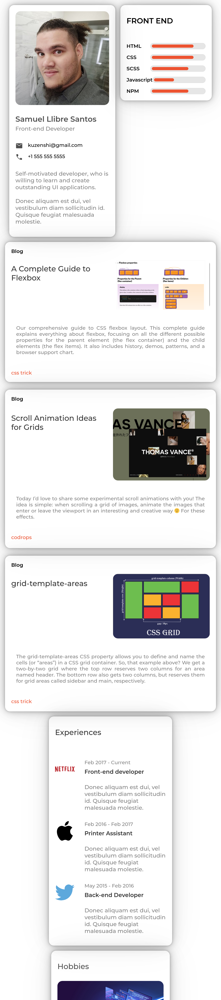

<h1 align="center">Portfolio Challenge</h1>

   Solution for a challenge from  <a href="http://devchallenges.io" target="_blank">Devchallenges.io</a>

  <h3>
    <a href="https://zyruks.com/challenges/devchallenges/portfolio/">
      Demo
    </a>
     | 
    <a href="https://github.com/Zyruks/dev-challenge/tree/main/portfolio">
      Solution
    </a>
     | 
    <a href="https://devchallenges.io/challenges/5ZnOYsSXM24JWnCsNFlt">
      Challenge
    </a>
  </h3>

<!-- TABLE OF CONTENTS -->

## Table of Contents

- [Overview](#overview)
  - [Built With](#built-with)
- [Features](#features)
- [Contact](#contact)
- [Acknowledgements](#acknowledgements)

<!-- OVERVIEW -->

## Overview

 

I try to use the bootstrap approach but create in scss. It's cool but I don't like not having full control over elements.

Maybe I will try bootstrap later and try to modify it with a different approach.

For the rest it was really intuitive.

### Built With

- 

- 

- 

- 

- 

## Features

This application/site was created as a submission to a [DevChallenges](https://devchallenges.io/challenges) challenge. The [challenge](https://devchallenges.io/challenges/5ZnOYsSXM24JWnCsNFlt) was to build an application to complete the given user stories.

## Acknowledgements

<!-- This section should list any articles or add-ons/plugins that helps you to complete the project. This is optional but it will help you in the future. For example -->

- [Steps to replicate a design with only HTML and CSS](https://devchallenges-blogs.web.app/how-to-replicate-design/)
- [Node.js](https://nodejs.org/)

## Contact

- Website [https://zyruks.com](https://zyruks.com)
- GitHub [@Zyruks](https://github.com/Zyruks/)
- Twitter [@Zyruks](https://twitter.com/Zyruks/)
